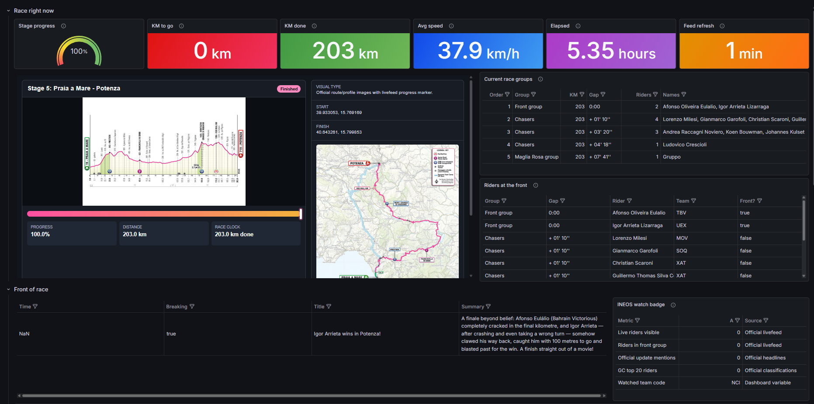

# Giro d'Italia 2026 Race Control Dashboard

[](https://docs.docker.com/compose/)
[](https://www.python.org/)
[](https://grafana.com/)

A local Grafana stack with a live Giro d'Italia race-control dashboard. Monitor stage progress, rider positions, team standings, and GC classifications in real-time.



## Features

- **Live Race Tracking** - Stage status, km completed, distance to go, race speed
- **Front of Race** - Real-time race groups, lead riders, breakaway alerts
- **INEOS Watch** - Dedicated panel for INEOS Grenadiers team tracking
- **GC & Jerseys** - General classification, points, mountains, youth, and super team standings
- **Official Data** - Direct integration with Giro d'Italia live feeds
- **Observability Stack** - Grafana 

## Architecture

```
┌─────────────┐     ┌─────────────┐     ┌─────────────┐
│   Giro      │────▶│  giro-data  │────▶│   Grafana   │
│  d'Italia   │     │  (FastAPI)  │     │  (Infinity) │
│   Official  │     └─────────────┘     └─────────────┘
│    Feeds    │           │                   
└─────────────┘           │            
                          │            
                          │            
                          │            
                   ┌─────────────┐
                   │  Renderer   │
                   │  (Images)   │
                   └─────────────┘
```

- **giro-data** - FastAPI service that fetches and normalizes official Giro data
- **lgtm** - Grafana (Otel-LGTM image) with provisioned dashboards and Infinity datasource
- **renderer** - Grafana image renderer for snapshot exports

## Prerequisites

- Docker & Docker Compose
- Internet access from Docker containers
- Ports available (or configured via `.env`):

| Service | Default Port |
|---------|--------------|
| Grafana | 3009 |
| giro-data | 8088 |

## Quick Start

```bash
# Clone the repository
git clone https://github.com/Unknowlars/Grafana-cio-de-italia-dashboard.git
cd grafana-stack

# Create environment file
cp .env.example .env

# Start the stack
docker compose up -d --build
```

### Access Grafana

- **URL**: http://localhost:3009
- **Credentials**: `admin` / `admin`

### Open the Dashboard

```
http://localhost:3009/d/giro-race-control-v12/giro-d-italia-2026-race-control-v12
```

### Stage 5 Example URL

```
http://localhost:3009/d/giro-race-control-v12/giro-d-italia-2026-race-control-v12?orgId=1&from=now-6h&to=now&timezone=browser&var-DS_INFINITY=infinity&var-stage=5&var-watched_team_code=NCI&refresh=30s
```

## API Health Checks

```bash
# Service health
curl http://localhost:8088/health

# Race data for stage 5
curl http://localhost:8088/api/v1/stage/5/race-now

# GC standings (top 5)
curl "http://localhost:8088/api/v1/standings/gc?limit=5"

# Team standings (top 5)
curl "http://localhost:8088/api/v1/standings/team?limit=5"
```

## Dashboard Sections

| Section | Description |
|---------|-------------|
| **Race Right Now** | Stage status, progress, km to go, speed, elapsed time, feed refresh, latest official situation |
| **Front of Race** | Race groups, front riders, INEOS badge, latest official updates |
| **INEOS Watch** | INEOS riders live, INEOS in front group, mentions in updates, GC context |
| **GC & Jerseys** | Official GC, points, mountains, youth, Super Team top five |
| **Details / Debug** | Source health, weather, raw feeds, source notes (collapsed by default) |

## Dashboard Source

The dashboard is generated from a Python builder:

```bash
# Regenerate dashboard JSON
python3 scripts/build_giro_race_control_v12.py
```

This produces: `grafana/dashboards/giro-ditalia-2026-race-control-v12.json`

The builder validates:
- No duplicate panel IDs
- No grid overflow or visible overlap
- Every panel has a description
- Every Infinity query has a datasource reference
- Risky UQL patterns are avoided

## Troubleshooting

### No dashboard visible

```bash
docker compose down -v
docker compose up -d --build
```

### Panels show no data

```bash
curl http://localhost:8088/health
docker compose logs --tail=100 giro-data
```

### Infinity blocks local service

Ensure `grafana/provisioning/datasources/datasource.yml` includes:

```yaml
allowedHosts:
  - http://giro-data:8080
```

### Dashboard URL changes after import

Use the provisioned UID: `/d/giro-race-control-v12/giro-d-italia-2026-race-control-v12`

## Stopping the Stack

```bash
# Stop containers (keep volumes)
docker compose down

# Reset everything (including volumes)
docker compose down -v
docker compose up -d --build
```

## Contributing

Contributions are welcome! Please feel free to submit a Pull Request.
---

*Built with Grafana, FastAPI, and the official Giro d'Italia data feeds.*